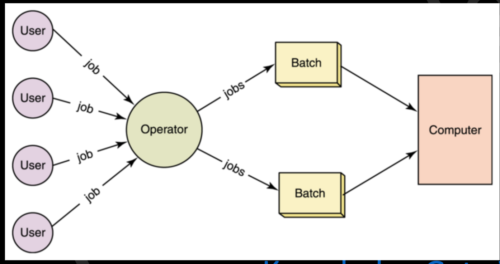

# Introduction: Generations Concept of of Operating Operating systems, Systems, Types of Operating Systems, OS Services, System Calls, Structure of an OS - Layered, Monolithic,Microkernel Operating Systems, Concept of Virtual Machine. Case study on UNIX and WINDOWS Operating System. 

An **Operating System (OS)** is system software that acts as an intermediary between the hardware of a computer and the user. It manages hardware resources and provides an environment for applications to run efficiently. In simple terms, it ensures the computer's hardware and software work together seamlessly.

---

### **Functions of an Operating System:**

1. **Process Management:**
   - Handles the creation, scheduling, and termination of processes.
   - Allocates CPU time to processes using scheduling algorithms.
   - Manages inter-process communication (IPC) and synchronization.

2. **Memory Management:**
   - Allocates and deallocates memory space as needed by programs.
   - Ensures efficient utilization of memory (e.g., swapping, paging, segmentation).
   - Prevents memory leaks and handles memory protection.

3. **File System Management:**
   - Organizes, stores, and retrieves data on storage devices.
   - Provides a hierarchical file structure and access methods (e.g., read, write, delete).
   - Enforces permissions and security for file access.

4. **Device Management:**
   - Manages input/output devices (e.g., keyboards, printers, hard drives).
   - Provides drivers and handles communication between hardware and software.
   - Ensures resource sharing and access through device scheduling.

5. **Storage Management:**
   - Manages data on secondary storage devices (e.g., hard drives, SSDs).
   - Provides abstractions like file systems and virtual memory.
   - Ensures data integrity through backups and recovery mechanisms.

6. **Security and Access Control:**
   - Protects data and system resources from unauthorized access.
   - Implements authentication (e.g., user accounts, passwords) and authorization.
   - Detects and prevents malicious activities (e.g., viruses, intrusions).

7. **User Interface (UI):**
   - Provides a user-friendly interface to interact with the system (CLI or GUI).
   - Examples: Command Prompt, Windows Explorer.

8. **Networking:**
   - Manages network communication and data sharing.
   - Supports protocols like TCP/IP, DNS, and routing.

9. **Error Detection and Handling:**
   - Detects system errors (e.g., hardware failures, resource conflicts).
   - Provides mechanisms to recover from errors and logs them for analysis.

10. **Resource Management:**
    - Allocates and schedules system resources like CPU, memory, and I/O devices.
    - Ensures fair resource allocation and resolves conflicts (deadlock, starvation).

Here’s a brief overview of the **generations of operating systems**, highlighting their evolution over time:

---

### **1st Generation (1940s - Early 1950s): No Operating Systems**
- **Characteristics:**
  - Computers were large and bulky, using vacuum tubes.
  - No OS existed; programs were written in machine code or assembly language.
  - Execution required manual intervention (e.g., wiring circuits, switches).
  - Jobs were run sequentially, one at a time.

- **Example Systems:**
  - ENIAC (Electronic Numerical Integrator and Computer)
  - UNIVAC (Universal Automatic Computer)

---

### **2nd Generation (1950s - Early 1960s): Batch Processing Systems**
- **Characteristics:**
  - Introduction of punched cards and magnetic tapes for input/output.
  - Jobs were grouped (or batched) and executed sequentially without user interaction.
  - Operating systems began to appear to manage jobs and I/O operations.
  - Limited resource management capabilities.

- **Key Innovations:**
  - **Batch Processing:** Grouping similar jobs for execution.
  - **Offline Processing:** Jobs prepared on offline systems and loaded later.

- **Example Systems:**
  - IBM 701
  - IBM 7090 with early batch OS.

---

### **3rd Generation (1960s - 1970s): Multiprogramming and Timesharing**
- **Characteristics:**
  - Use of transistors reduced size and cost.
  - **Multiprogramming:** Multiple programs loaded in memory simultaneously.
  - **Timesharing:** Allowed multiple users to interact with the system concurrently using terminals.
  - Improved resource management (CPU scheduling, memory allocation).

- **Key Innovations:**
  - Development of the **UNIX** operating system (1969).
  - Introduction of spooling (Simultaneous Peripheral Operation On-Line).
  - Early forms of virtual memory.

- **Example Systems:**
  - IBM System/360 (used OS/360).
  - MULTICS (predecessor to UNIX).

---

### **4th Generation (1970s - 1990s): Personal Computers and Graphical User Interfaces (GUI)**
- **Characteristics:**
  - Advent of microprocessors enabled personal computers.
  - Focus shifted to user-friendly interfaces and multitasking.
  - Introduction of **Graphical User Interfaces (GUI)**.

- **Key Innovations:**
  - Operating systems for personal computers: MS-DOS, Mac OS.
  - Development of networks and networked OS (e.g., Novell NetWare).
  - Emergence of multitasking and multiuser systems.

- **Example Systems:**
  - Windows 1.0 (1985).
  - Apple Lisa (1983) and Macintosh System Software.

---

### **5th Generation (1990s - Present): Modern Operating Systems**
- **Characteristics:**
  - Designed for portability, scalability, and internet connectivity.
  - Support for multiprocessor systems and distributed computing.
  - Focus on security, cloud computing, and virtualization.

- **Key Innovations:**
  - Real-time operating systems for critical applications.
  - Mobile operating systems (Android, iOS).
  - Cloud-based OS and containerization (Docker, Kubernetes).
  - High-level GUIs with advanced user experience.

- **Example Systems:**
  - Windows (NT family, 10, 11).
  - macOS, Linux distributions.
  - Android, iOS.

Here’s an overview of the **types of operating systems**, categorized based on their design and functionality:

---

### **1. Batch Operating System**
  

- **Description:** 
  - Executes jobs in batches without direct interaction with the user.
  - Jobs with similar requirements are grouped and processed sequentially.
- **Key Features:** 
  - No direct communication with the system during execution.
  - Efficient for jobs requiring similar resources.
- **Examples:** 
  - IBM OS/360, early mainframe systems.

---

### **2. Time-Sharing Operating System**
  
- **Description:** 
  - Allows multiple users to access a computer system simultaneously by sharing CPU time.
  - Uses a concept called **time slices**, where the CPU switches between tasks quickly.
- **Key Features:** 
  - Interactive user sessions.
  - Ensures responsiveness by minimizing idle CPU time.
- **Examples:** 
  - UNIX, MULTICS.

---

### **3. Distributed Operating System**
- **Description:** 
  - Runs on multiple interconnected systems, providing a unified interface.
  - Distributes computation and resources across multiple machines.
- **Key Features:** 
  - High reliability and scalability.
  - Improves performance through resource sharing.
- **Examples:** 
  - Apache Hadoop, Amoeba, Microsoft Azure.

---

### **4. Network Operating System (NOS)**
- **Description:** 
  - Designed to manage network resources like files, printers, and applications.
  - Provides services like file sharing, communication, and user management.
- **Key Features:** 
  - Centralized control over network resources.
  - Users are aware of the network's existence.
- **Examples:** 
  - Novell NetWare, Windows Server, UNIX.

---

### **5. Real-Time Operating System (RTOS)**
- **Description:** 
  - Designed to process tasks within a strict time limit.
  - Used in systems where response time is critical.
- **Key Features:** 
  - **Hard RTOS:** Guarantees task completion within a deadline.
  - **Soft RTOS:** Prioritizes tasks but may tolerate some delays.
- **Examples:** 
  - VxWorks, QNX, FreeRTOS.

---

### **6. Multi-User Operating System**
  
- **Description:** 
  - Allows multiple users to work on the same system simultaneously.
  - Provides separate resources and environments for each user.
- **Key Features:** 
  - Focus on user security and resource isolation.
  - Prevents conflicts between users.
- **Examples:** 
  - UNIX, Linux, Windows Server.

---

### **7. Multiprocessing Operating System**
  
- **Description:** 
  - Utilizes multiple processors to run processes in parallel.
  - Increases throughput and reliability.
- **Key Features:** 
  - Symmetric multiprocessing (SMP): All processors are treated equally.
  - Asymmetric multiprocessing (AMP): Processors have specific tasks.
- **Examples:** 
  - Linux, Windows 10/11 with multi-core support.

---

### **8. Mobile Operating System**
- **Description:** 
  - Designed for smartphones, tablets, and other portable devices.
  - Optimized for touch input, sensors, and power efficiency.
- **Key Features:** 
  - User-friendly interfaces and app ecosystems.
  - Seamless integration with hardware.
- **Examples:** 
  - Android, iOS.

---

### **9. Embedded Operating System**
- **Description:** 
  - Built to operate specific hardware in embedded systems.
  - Used in devices like IoT gadgets, ATMs, and automotive systems.
- **Key Features:** 
  - Lightweight and efficient.
  - Real-time constraints in some cases.
- **Examples:** 
  - FreeRTOS, Contiki OS, Embedded Linux.

---

### **10. Virtual Machine Operating System**
- **Description:** 
  - Allows multiple operating systems to run on a single physical machine.
  - Provides a virtual environment for each OS instance.
- **Key Features:** 
  - Resource isolation and virtualization.
  - Ideal for testing and server management.
- **Examples:** 
  - VMware ESXi, Microsoft Hyper-V.

**Spooling** (short for **Simultaneous Peripheral Operations On-Line**) is a process used in computer systems to manage input/output (I/O) operations efficiently. It allows slower peripheral devices, like printers or disk drives, to operate concurrently with faster CPU processes by temporarily storing data in a buffer (e.g., a disk or memory).

---

### **Key Concepts of Spooling:**
1. **Buffering Data:**
   - Data is stored in a temporary area (buffer) before being sent to the peripheral device.
   - This allows the CPU to continue executing other tasks instead of waiting for the device to complete its operation.

2. **Queue Management:**
   - Spooling works like a queue where multiple tasks can wait their turn to access the peripheral device.
   - Each task is processed one by one in the order they arrive.

3. **Decoupling:**
   - Spooling decouples the CPU from the slower I/O device, improving system throughput and resource utilization.

---

### **Common Applications of Spooling:**

1. **Printing (Print Spooling):**
   - When multiple print jobs are sent to a printer, they are spooled in a queue.
   - The printer processes jobs sequentially while the CPU handles other tasks.

2. **Batch Processing:**
   - Jobs in batch systems are spooled to disk before execution.
   - This allows jobs to be submitted offline and executed sequentially.

3. **Data Transfer:**
   - Spooling is used in data transfer scenarios, such as downloading files to a buffer before saving them to disk.

---

### **Advantages of Spooling:**
1. **Increased Efficiency:**
   - The CPU can perform other tasks while data is being processed by slower devices.
   
2. **Resource Utilization:**
   - Devices are used more effectively as jobs are queued and processed in sequence.

3. **Concurrency:**
   - Multiple jobs can be spooled simultaneously, allowing better multitasking.

---

### **Example of Print Spooling in Action:**
1. A user sends a print job to a shared network printer.
2. The operating system spools the print job to a disk buffer.
3. While the printer processes the job, the CPU continues executing other tasks.
4. Once the printer is free, it processes the next job in the spool.

Here's a comparison between **Multi-programming**, **Multi-tasking**, and **Multi-processing** operating systems:

---

### **1. Multi-programming Operating System**
- **Definition:**
  - Multiple programs are loaded into memory and executed **one at a time**.
  - The CPU switches between programs when one program is waiting (e.g., for I/O).
  
- **Key Features:**
  - Maximizes CPU utilization.
  - Aims to minimize idle CPU time by having another job ready when one is waiting.

- **Limitations:**
  - Lacks interactive capabilities; primarily used in batch processing systems.
  - No real-time user interaction with the system.

- **Examples:**
  - Early UNIX systems, IBM OS/360.

---

### **2. Multi-tasking Operating System**
- **Definition:**
  - Allows a user or multiple users to perform **multiple tasks simultaneously** by switching the CPU between tasks rapidly.
  
- **Key Features:**
  - Tasks (or processes) are executed concurrently, giving the illusion of parallelism.
  - Uses **time-sharing** to allocate small time slices to each task.
  - Supports **interactive computing**, allowing users to run programs interactively.

- **Types:**
  - **Preemptive Multi-tasking:** The OS controls CPU allocation (e.g., Windows, UNIX).
  - **Cooperative Multi-tasking:** Programs voluntarily yield the CPU (e.g., earlier Mac OS versions).

- **Examples:**
  - Windows, macOS, Linux.

---

### **3. Multi-processing Operating System**
- **Definition:**
  - A system with **multiple CPUs or cores** that work together to execute processes **in parallel**.
  
- **Key Features:**
  - Processes are divided among CPUs, enabling true parallelism.
  - Increases system throughput and reliability.

- **Types of Multi-processing:**
  - **Symmetric Multiprocessing (SMP):** All processors share the same memory and perform tasks equally.
  - **Asymmetric Multiprocessing (AMP):** Specific processors handle dedicated tasks.

- **Examples:**
  - Modern Linux, Windows 10/11, macOS with multi-core processors.

---

### **Comparison Table**

| Feature                 | Multi-programming       | Multi-tasking            | Multi-processing          |
|-------------------------|-------------------------|--------------------------|---------------------------|
| **Definition**           | Runs multiple programs, one at a time, using CPU switching. | Runs multiple tasks by switching between them rapidly. | Runs processes in parallel using multiple CPUs. |
| **Execution**            | Sequential execution of jobs. | Concurrent execution via time-sharing. | True parallel execution. |
| **Concurrency**          | Simulated concurrency. | Simulated concurrency.   | Real concurrency.         |
| **Objective**            | Maximize CPU utilization. | Allow users to run multiple tasks interactively. | Increase system performance and reliability. |
| **Hardware Requirement** | Single CPU is sufficient. | Single CPU is sufficient. | Requires multiple CPUs or cores. |
| **Examples**             | Early UNIX, IBM OS/360. | Windows, macOS, Linux.   | Modern Linux, Windows 10/11. |

## System Call

In computing, a system call (commonly abbreviated to syscall) is the programmatic way in which a computer program requests a service from the operating system on which it is executed. This may include hardware-related services (for example, accessing a hard disk drive or accessing the device's camera), creation and execution of new processes, and communication with integral kernel services such as process scheduling. System calls provide an essential interface between a process and the operating system.

### **Operating System Services**

Operating systems provide a set of **services** to make system functionality accessible to users and programs. These services ensure smooth interaction between users, applications, and hardware.

---

#### **1. User-Level Services**
1. **Program Execution:**
   - Loads and executes programs.
   - Handles process creation, scheduling, and termination.
   
2. **I/O Operations:**
   - Manages input/output operations for devices like keyboards, monitors, disks, etc.
   - Abstracts hardware-level details for user convenience.

3. **File System Manipulation:**
   - Provides functions to read, write, create, and delete files.
   - Ensures data storage and retrieval with appropriate access permissions.

4. **Communication:**
   - Facilitates communication between processes (Inter-Process Communication or IPC).
   - Supports mechanisms like message passing, shared memory, and sockets.

5. **Error Detection:**
   - Identifies and handles errors in hardware, software, or user programs.
   - Provides error-recovery mechanisms to ensure system stability.

---

#### **2. System-Level Services**
1. **Resource Allocation:**
   - Distributes CPU time, memory, I/O devices, etc., among multiple processes.

2. **Accounting:**
   - Keeps track of system resource usage.
   - Useful for billing (in cloud systems) or debugging performance issues.

3. **Protection and Security:**
   - Ensures data and resource protection against unauthorized access.
   - Implements user authentication, encryption, and access control mechanisms.

---

### **System Calls**

**System calls** are the interface between user applications and the operating system. They allow applications to request OS services.

---

#### **Categories of System Calls**

1. **Process Control:**
   - To manage processes (creation, termination, etc.).
   - Examples:
     - `fork()` (create a process),
     - `exit()` (terminate a process),
     - `exec()` (replace process memory with a new program).

2. **File Management:**
   - To handle file operations.
   - Examples:
     - `open()` (open a file),
     - `read()` (read data from a file),
     - `write()` (write data to a file),
     - `close()` (close a file).

3. **Device Management:**
   - To manage devices and perform I/O operations.
   - Examples:
     - `ioctl()` (control device settings),
     - `read()` and `write()` for device communication.

4. **Information Maintenance:**
   - Retrieve or set system-related information.
   - Examples:
     - `getpid()` (get process ID),
     - `alarm()` (set a timer).

5. **Communication:**
   - To enable interaction between processes or systems.
   - Examples:
     - `pipe()` (create an inter-process communication channel),
     - `socket()` (establish a network connection).

---

#### **How System Calls Work**
1. A program executes a **library function** (e.g., `printf()`).
2. The library function issues a **system call** (e.g., `write()`).
3. The system call triggers a **trap/interrupt** to switch to kernel mode.
4. The OS kernel executes the requested operation and returns the result.

---

### **System Call vs. Library Call**

| **Aspect**          | **System Call**                 | **Library Call**             |
|---------------------|---------------------------------|-----------------------------|
| **Execution Mode**   | Runs in kernel mode.            | Runs in user mode.           |
| **Direct Access**    | Directly interacts with the OS. | Accesses the OS via system calls. |
| **Overhead**         | Higher (context switching).     | Lower (no kernel involvement). |
| **Example**          | `read()`, `write()`.            | `printf()`, `scanf()`.       |

### **Structure of an Operating System**

Operating systems can be designed using various architectural models to organize their components and manage interactions between hardware and software. Below are the key OS structures:

---

### **1. Layered Operating System**
  
- **Concept:**
  - The OS is divided into layers, where each layer has a specific function.
  - Layers interact only with their adjacent layers (up or down).

- **Structure:**
  - Top layers handle user interaction and high-level abstractions.
  - Bottom layers interact with hardware.

- **Advantages:**
  - Modular design makes debugging and updates easier.
  - Changes in one layer do not affect others.

- **Disadvantages:**
  - Strict layering can reduce performance due to overhead in communication between layers.
  - Designing and maintaining layers can be complex.

- **Example:**
  - THE operating system, Multics.

---

### **2. Monolithic Operating System**
- **Concept:**
  - The entire OS is a single large program where all components (e.g., process management, file system, device drivers) run in **kernel mode**.
  - All parts of the OS can directly interact with each other.

- **Structure:**
  - No strict modularity; components are tightly integrated.

- **Advantages:**
  - High performance due to minimal communication overhead.
  - Simplicity in terms of structure.

- **Disadvantages:**
  - Poor maintainability; a bug in one component can crash the entire system.
  - Lack of modularity makes it harder to debug or update.

- **Examples:**
  - UNIX, MS-DOS, Linux (early versions).

---

### **3. Microkernel Operating System**
  
- **Concept:**
  - Only essential services (e.g., process scheduling, memory management, IPC) run in **kernel mode**.
  - All other services (e.g., device drivers, file systems) run in **user mode** as separate processes.

- **Structure:**
  - Small kernel with minimal functionality.
  - Additional services are modular and can be added or removed independently.

- **Advantages:**
  - High reliability; a failure in a user-mode service doesn't crash the kernel.
  - Easier to extend and maintain.
  - Improved security since most services run outside the kernel.

- **Disadvantages:**
  - More overhead due to context switching and IPC.
  - Can be slower compared to monolithic OS.

- **Examples:**
  - macOS, QNX, MINIX, Windows NT (hybrid microkernel).

---

### **4. Concept of Virtual Machine**
- **Definition:**
  - A **virtual machine (VM)** is a software-based emulation of a physical computer.
  - It allows multiple OS instances to run on a single physical machine.

- **Types of Virtual Machines:**
  1. **System Virtual Machine:**
     - Emulates a complete physical machine, including hardware.
     - Examples: VMware, VirtualBox, Hyper-V.
  2. **Process Virtual Machine:**
     - Runs a single program in a platform-independent environment.
     - Example: Java Virtual Machine (JVM).

- **Key Features:**
  - Isolation: Each VM operates independently of others.
  - Portability: VMs can run on different hardware platforms.
  - Efficiency: Multiple VMs share the same physical hardware.

- **Advantages:**
  - Allows testing and running multiple OSes on the same hardware.
  - Supports fault isolation, as a crash in one VM doesn't affect others.

- **Disadvantages:**
  - Overhead due to the virtualization layer.
  - Performance can be lower compared to running directly on hardware.

- **Use Cases:**
  - Cloud computing (e.g., AWS, Azure).
  - Development and testing environments.

---

### **Comparison Table**

| Feature                 | Layered OS            | Monolithic OS       | Microkernel OS        | Virtual Machine         |
|-------------------------|-----------------------|---------------------|-----------------------|-------------------------|
| **Structure**           | Organized in layers. | Single large kernel.| Small kernel + user services. | Simulates a physical machine. |
| **Performance**         | Moderate             | High                | Low to moderate       | Depends on VM software. |
| **Modularity**          | High                 | Low                 | Very high             | High                    |
| **Fault Isolation**     | Partial              | None                | High                  | High                    |
| **Examples**            | Multics              | UNIX, MS-DOS        | macOS, MINIX          | VMware, VirtualBox      |

### **CLI (Command Line Interface)**

**Definition:**
- A **Command Line Interface (CLI)** is a user interface where users interact with the operating system or software by typing commands into a text-based terminal.

---

#### **Features of CLI:**
1. **Text-Based:**
   - Entirely relies on text commands.
2. **Keyboard Input:**
   - All interactions are done using the keyboard.
3. **Efficient for Experts:**
   - Offers advanced functionality and speed for users familiar with commands.

---

#### **Advantages of CLI:**
1. **Low Resource Usage:**
   - Does not require a graphical environment, making it lightweight.
2. **Efficient for Power Users:**
   - Complex tasks can be automated using scripts.
3. **Flexible:**
   - Allows direct communication with the operating system and deeper system control.
4. **Remote Accessibility:**
   - CLI can easily be accessed remotely via SSH (e.g., managing servers).

---

#### **Disadvantages of CLI:**
1. **Steep Learning Curve:**
   - Requires memorization of commands and syntax.
2. **Error-Prone:**
   - A single typo can result in incorrect execution.
3. **Less Intuitive:**
   - Not user-friendly for beginners.

---

#### **Examples of CLI Tools:**
- **Operating Systems:**
  - Bash (Linux/Unix).
  - Command Prompt or PowerShell (Windows).
- **Software:**
  - Git, Docker, Node.js, etc.

---

### **GUI (Graphical User Interface)**

**Definition:**
- A **Graphical User Interface (GUI)** is a user interface that allows interaction with the system using graphical elements like windows, buttons, icons, and menus.

---

#### **Features of GUI:**
1. **Graphical Elements:**
   - Uses icons, buttons, and visual indicators to represent actions and files.
2. **Mouse and Keyboard:**
   - Interaction is achieved using a mouse, keyboard, or touch input.
3. **User-Friendly:**
   - Designed to be intuitive and easy to use.

---

#### **Advantages of GUI:**
1. **Ease of Use:**
   - Intuitive, making it suitable for beginners.
2. **Visual Representation:**
   - Graphical elements make it easier to understand and interact with the system.
3. **Multitasking:**
   - Enables users to work on multiple tasks simultaneously using windows.
4. **Rich Interaction:**
   - Supports drag-and-drop, resizing, and more.

---

#### **Disadvantages of GUI:**
1. **Resource Intensive:**
   - Requires more system resources (CPU, memory, GPU) than CLI.
2. **Slower for Advanced Users:**
   - Certain tasks can be slower compared to CLI for experienced users.
3. **Limited Control:**
   - Some advanced functionalities may not be accessible via GUI.

---

#### **Examples of GUI:**
- **Operating Systems:**
  - Windows, macOS, Ubuntu (Desktop environments like GNOME/KDE).
- **Software:**
  - Browsers (e.g., Chrome), text editors (e.g., MS Word), file managers.

---

### **Comparison Table: CLI vs GUI**

| **Aspect**            | **CLI**                               | **GUI**                              |
|-----------------------|---------------------------------------|--------------------------------------|
| **Interface Type**     | Text-based                           | Graphical (icons, windows, menus).   |
| **Ease of Use**        | Difficult for beginners              | Easy and intuitive for all users.    |
| **Speed**              | Faster for experienced users         | Slower due to reliance on graphics.  |
| **Resource Usage**     | Low                                  | High (requires graphical processing).|
| **Flexibility**        | High (custom commands/scripts)       | Limited for complex tasks.           |
| **Error-Prone**        | High (typos can cause issues)        | Low (clicks minimize errors).        |
| **Examples**           | Bash, Command Prompt, PowerShell     | Windows Explorer, macOS Finder       |

---

### **Hybrid Interfaces**
- Some systems offer **both CLI and GUI** for flexibility:
  - Example: Linux OS (Graphical desktop + terminal for CLI).
### **Mode Bit in Operating Systems**

The **mode bit** is a hardware-supported mechanism in modern processors that distinguishes between two primary modes of operation for an operating system:

1. **User Mode (Mode bit = 1)**: 
   - The system runs applications or user-level programs.
   - Restricted access to critical resources.
   
2. **Kernel Mode (Mode bit = 0)**:
   - The system runs privileged operations, including OS kernel functions.
   - Full access to hardware and critical system resources.

The **mode bit** plays a crucial role in ensuring system security, stability, and isolation by preventing user programs from directly accessing critical resources or compromising the system.

---

### **How the Mode Bit Operates**
1. **Initial State (Kernel Mode):**
   - When the computer boots, the system starts in **kernel mode** since the OS must initialize the hardware, set up memory management, and load system processes.
   - Mode bit = 0.

2. **Switch to User Mode:**
   - After the OS finishes initialization, it launches user-level applications and switches to **user mode**.
   - The mode bit is set to **1** (user mode).
   - In this mode, user programs are restricted and cannot execute privileged instructions directly.

3. **User Program Requests Kernel Services (System Call):**
   - When a user application needs a service (e.g., I/O operations, memory management), it issues a **system call**.
   - The mode bit transitions back to **kernel mode** (Mode bit = 0) to safely execute the requested operation.
   - After completing the request, the system switches back to **user mode**.

4. **Interrupts and Exceptions:**
   - During user mode execution, if an interrupt (e.g., I/O completion, timer) or exception (e.g., divide-by-zero error) occurs, the processor automatically:
     - Saves the program’s state.
     - Switches to **kernel mode** to handle the interrupt.
   - Once the interrupt/exception is handled, the system restores the program's state and returns to **user mode**.

---

### **Key Operations Governed by the Mode Bit**
1. **Switching Modes:**
   - **From User Mode to Kernel Mode:**
     - Triggered by:
       - A **system call**.
       - An **interrupt**.
       - An **exception**.
     - Steps:
       1. Processor sets the mode bit to 0 (kernel mode).
       2. Control is transferred to a predefined entry point in the OS (interrupt vector or system call handler).
   - **From Kernel Mode to User Mode:**
     - Occurs after the OS completes a privileged operation or system call.
     - Mode bit is set to 1, and control returns to the user program.

2. **Privileged Instructions:**
   - Certain CPU instructions (e.g., modifying the mode bit, I/O operations, accessing hardware) can only be executed in **kernel mode**.
   - If a user program tries to execute these instructions, the processor raises a **privilege exception**.

3. **Memory Access Control:**
   - In user mode, programs are restricted to their own memory space.
   - Kernel mode allows unrestricted memory access, enabling the OS to manage memory efficiently.

4. **I/O Device Management:**
   - I/O operations are performed in kernel mode to prevent unauthorized or unsafe access to hardware devices.

---

### **Benefits of the Mode Bit**
1. **Security:**
   - Prevents user programs from directly accessing critical system resources or executing privileged instructions.
   - Protects the OS from malicious or buggy applications.

2. **Stability:**
   - Ensures user programs cannot accidentally corrupt the OS or other processes.

3. **Fault Isolation:**
   - If a user program fails, it operates within restricted boundaries and cannot affect the system's core functions.

---

### **Example: System Call Using Mode Bit**

1. **User Mode (Mode bit = 1):**
   - The application calls a library function (e.g., `read()` in Linux).
   - The library function issues a **trap** instruction, which transitions the mode to **kernel mode**.

2. **Kernel Mode (Mode bit = 0):**
   - The OS verifies the parameters passed by the user program.
   - The OS performs the requested operation (e.g., reading a file).
   - After completion, the OS sets the mode bit back to 1 and returns to the user program.

---

### **Mode Bit in Modern Architectures**
1. **x86 Architecture:**
   - Provides multiple privilege levels (called **rings**), with:
     - Ring 0: Kernel mode (highest privilege).
     - Ring 3: User mode (least privilege).
   - Mode bit essentially distinguishes between Ring 0 (kernel) and Ring 3 (user).

2. **ARM Architecture:**
   - Uses **processor modes** (e.g., user mode, supervisor mode).
   - The mode bit differentiates between normal user execution and privileged execution.

---

### **Summary**
- The mode bit is a fundamental mechanism for achieving **process isolation**, **system stability**, and **security** in an operating system.
- By switching between **user mode** and **kernel mode**, the OS ensures that critical operations are executed safely without risking interference from user applications.
